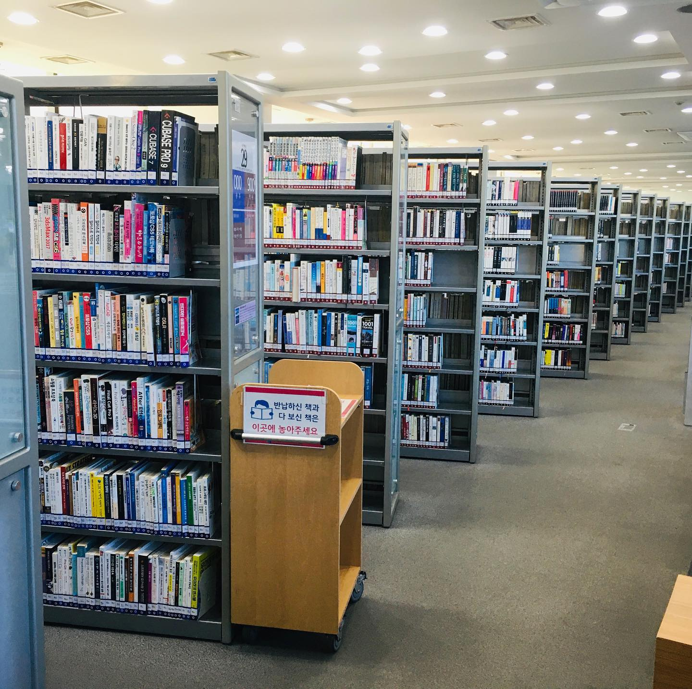
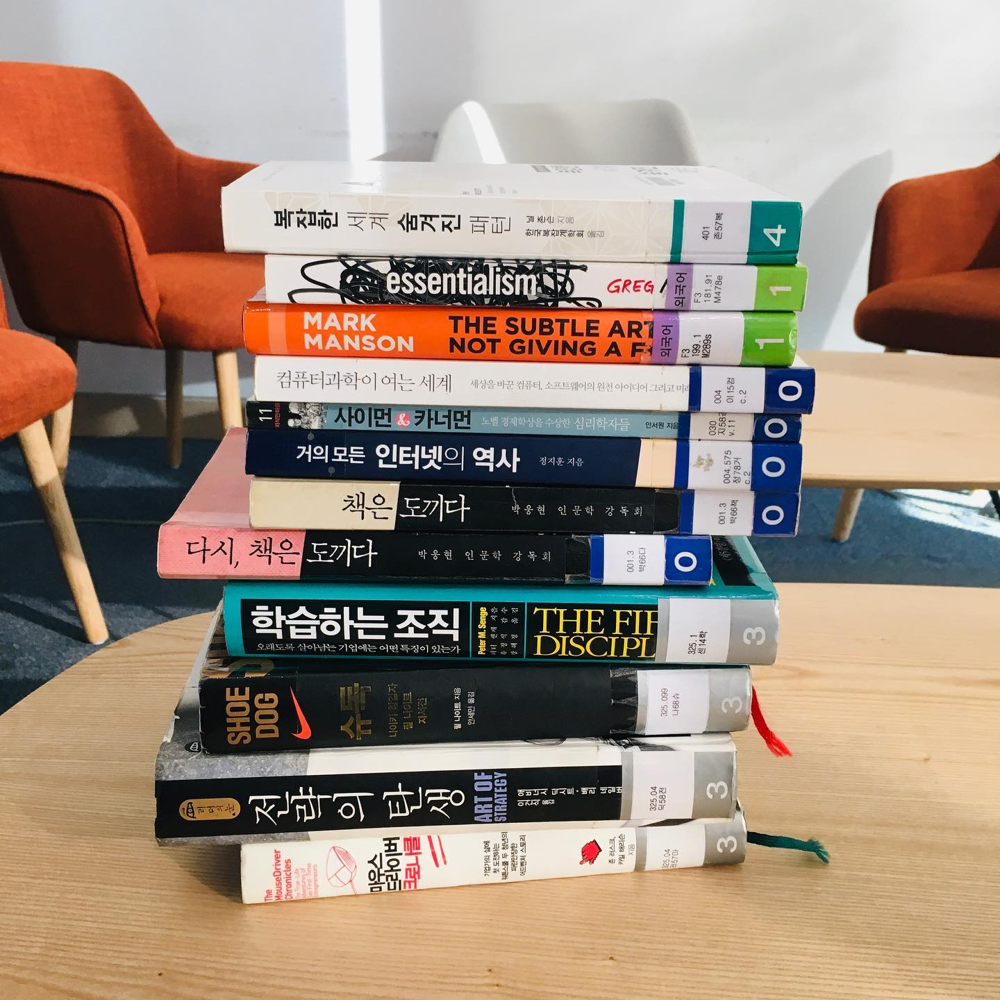

매일 아침 오늘은 뭐 쓸지 고민한다. 일단 사진이 필요한데, 집-회사를 오가는 루틴한 하루에서는 뭔가 카메라로 찍을만한 게 잘 없는 것 같다. '좀 색다른 걸 한 게 있어야 쓰기가 쉬운데..'
⠀
갑자기 요즘 라이프가 단조롭단 생각이 들었다. 나쁜 건 아니다. 되게 좋다. 하지만 왠지 잠깐 일상에서 살짝 벗어난 걸 해보고 싶었다. '늘 가는 곳 말고 다른 곳에 잠깐 시간을 내서 가보자. 내가 좋아하지만 한 동안 못 갔던 곳으로' 그래서 어제 동네 도서관에 갔다.
⠀
동대문정보화도서관은 3층짜리 건물이다. 주택가에 있는 전형적 동네 도서관. 어릴 때 참 많이 왔었다. 중학교 때 맨날 813(한국문학) 서가에 가서 판타지/무협 소설을 빌려봤다. 이영도의 눈마새, 이우혁의 퇴마록, 김민영의 팔란티어 같은 책을 섭렵했지. 인기 많은 책들이라 1권은 항상 못 구했다. 1,2권은 동네 만화책방에서 빌리고 나머지만 도서관에서 봤던 기억이 난다.
⠀
내가 도서관을 좋아하는 이유가 있다. (남들한테 별로 말하지 않는 건데) 난 서가를 돌아다니면서 '아이쇼핑'을 하는 걸 엄청 좋아한다. 일단 서가에 책이 주욱 꽂혀있는 거 보기만 해도 기분이 좋다. 책꽂이를 훑으면서 어떤 책이 있나 훑어본다. 제목이 흥미롭네. 디자인이 잘 빠졌네. 저자가 아는 사람인데? 하면 그런 걸 꺼내서 책 날개를 읽어본다. 그것도 재미있으면 서문을 읽어본다. '이 책 좋다' 하면 옆구리에 낀다. 그렇게 도서관 한쪽 끝에서 반대쪽 끝까지 간다.
⠀
서점하곤 좀 다르다. 서점은 유명한 책들, 최신 책들 위주로 진열되어있다. 뭔가 내가 예상치 못했던 책, 오래된 책, 처음 보는 책을 찾아내는 재미가 별로 없다. 반면 도서관은 도서분류법과 가나다순으로만 꽂아놓는다. 책을 마주치는 재미가 있다.
⠀
솔직히 고른 책 백퍼 다 못 읽는다. 요즘 잘 안했던 이유다. 집에도 못 읽은 책이 수두룩하다. 아이쇼핑을 하면 욕심 내서 왕창 빌려온 다음 다 못 읽고 반납한다. 심지어 리디셀렉트에서 다운받은 전자책도 가득한데.
⠀
하지만 오늘은 좋아하지만 안 했던 걸 한번 해보는 취지였으니까, 괜찮다고 생각하기로 했다. 백화점 가서 하루종일 옷 백 개쯤 입어보고 무지티 하나 사와도 재미만 있으면 되는거 아니겠는가. 1시간반 동안 재밌게 책 구경하다가 출근했다.

