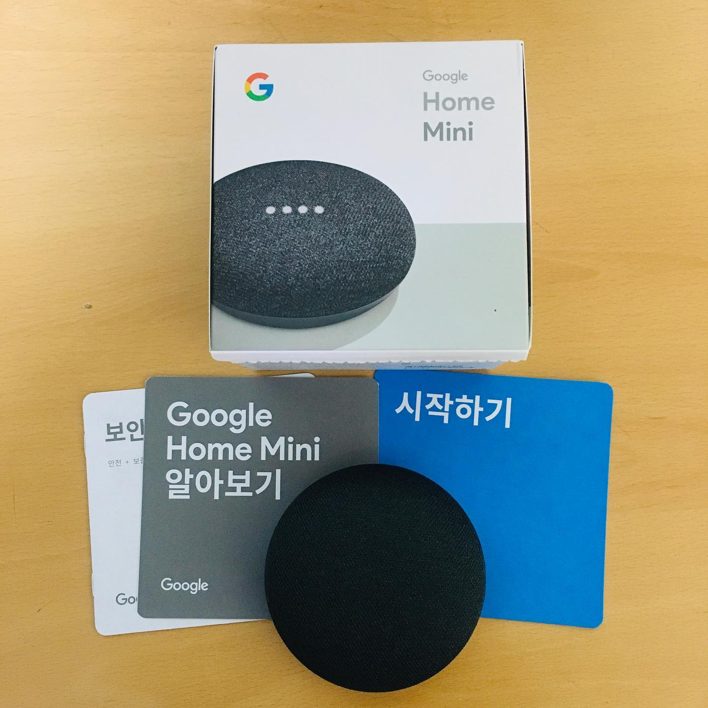

구글 홈 미니가 왔다. 얼마 전 구글에서 이벤트를 했다. 유튜브 프리미엄 구독자한테 무료 증정해줬다. 난 AI 스피커가 별로 필요하진 않았다. 예전에 카카오 미니 샀다 돈 버린 기억이 있다. 아마 돈 주고 사라면 안 샀을 거다. 하지만 공짜라.. 그렇다면 얘기가 다르지?
⠀
하루 써보고 느낀 점. '없어도 그만, 있으면 좋네' 처음엔 신기해서 막 써본다. 나중엔 점점 음악 트는 것 외엔 안 쓰게 된다.
⠀
물론 '여윽시 구글'스러운 기능도 몇 개 있다. 보이스 매치란 게 있는데, 어떤 사람 목소리인지 알아듣는다. (시작할 때 이거 동의받는데 살짝 무섭기도) 카카오 미니보다 말귀도 훨씬 잘 알아듣는다. 헤이 카카오는 못 알아들어서 2-3번 더 부른 적이 많았다. 헤이 구글은 빠릿빠릿하다. 게다가 한국어 하다가 영어로 해도 다 알아듣는다.
⠀
하지만 이 이상 기능은 매우 제한적이다. 일단 연결할 앱이 많아야 AI 비서같은 느낌이 날텐데. 연결가능한 리스트에서 내가 쓰는 건 유튜브 뮤직밖에 없었다. (아 그래서 유튜브 프리미엄 구독자한테 뿌렸구나)
⠀
스마트 전등, 스마트TV 같은 건 내가 없으니까 그렇다 쳐도.. 팟캐스트도 틀어주고, 카카오톡도 읽어주고, 네이버 쇼핑도 돼줘야 '아.. 역씌 인공지능이구나,,,' 할 거 아니겠는가.
⠀
물론.. 애플, 카카오, 삼성 같은 IT기업들이 경쟁사 구글에게 그걸 내어줄리 없다. 자기들 인공지능 스피커가 다 있으니까. 아이러니하게도 그래서 아무것도 쓸모가 없다. 카카오톡은 멜론만 되고, 애플은 애플 뮤직만 되고, 기가지니는 올레티비만 되고 뭐 이런 식이다.
⠀
이메일처럼 다들 공동의 프로토콜/표준을 써서 통일시키면 참 좋겠다. 구글이 애플TV도 켤 수 있고, 빅스비가 카카오톡도 보낼 수 있게 말이다. 하지만 요즘 잘 나가는 회사들은 다 가두리 생태계 방식으로 성공했으니 그럴 가능성은 낮아 보인다. 음성인식 기술력은 계속 발달하겠지만, 쓸만한 AI 스피커는 그것보다 한참 먼 것 같다.
#1일1글

