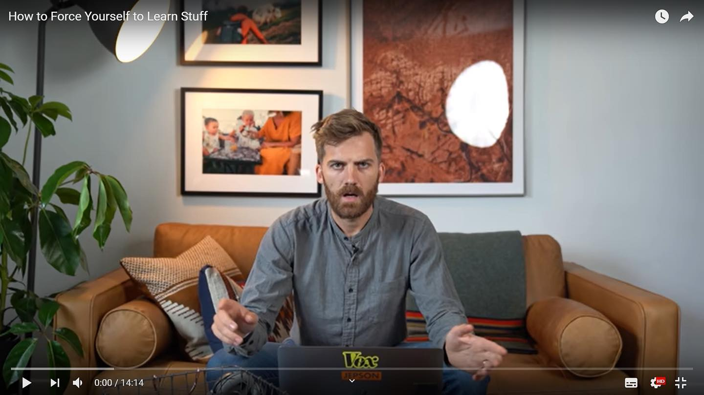

유튜브에서 우연히 영상 하나를 봤다. Johnny Harris라고. Vox의 영상기자다. 영상 제목은 자신이 강제로 배우도록 하는 방법. (how to force yourself to learn stuff)
⠀
Johnny가 기자가 되기 한참 전. 그는 영상편집과 모션그래픽에 관심이 있었다. 강의를 들으면서 조금씩 배웠다. 시간이 지나자 열정이 점점 사그라들었다. 많은 사람들이 뭔가를 배울 때 그러듯이. 그는 자신이 배우는 속도가 마음에 들지 않았다.
⠀
그러다 정부 기관 프로그램 소개 영상을 보게 된다. 너~무 못 만들었다고 한다. 그는 기관에 메일을 보냈다. "너네 영상 너무 구리다. 내가 공짜로 더 좋은 거 만들어줄게, 어때?"라고. 공짜라니까 기관은 당연히 오케이였다.
⠀
기존 영상을 대차게 깐 상태였다. 내가 더 잘 만들겠다고 약속을 해놨다. 그러자 Johnny는 슬럼프가 왔던 영상편집에 다시 의욕이 생겼다. 자발적으로 책임감을 만들어낸 것이다. 그는 그 영상을 만들던 1주일이, 인생에서 가장 빠르게 영상 스킬을 배웠던 때라고 했다. 이걸 'Excited Accountability' 전략이라고 부른다.
⠀
나도 비슷한 경험이 있다. 책 쓸 때였다. '내가 쓸 수 있을까?'라는 생각이 가시기도 전에 출판계약서를 써버렸다. 계약서에는 언제까지 원고를 마감하겠다는 날짜가 적혀있었다. 심지어 선수금도 줬다.
⠀
물론, 그거 어긴다고 감옥 가진 않는다. 하지만 뭔가 문서로 약속을 해놓고 보니까 큰 책임감이 생겼다. 당시 난 학교, 인턴, 부업까지 병행해서 진짜 바빴다. 지금 돌아보니까 원고를 마무리하던 그 1-2달의 시간 동안 엄청나게 많은 일을 했다. 그 때만큼 집중적으로 지식을 흡수한 적이 없었다. 글쓰기 실력도 눈에 띄게 늘었다.
⠀
덕분에 Johnny의 방법이 공감이 갔다. 배워보고 싶은 게 있으면, 일단 질러보자. (물론 누구에게나, 어떤 상황에서나 통하는 방법은 아닐 수 있다.) 글을 잘 쓰고 싶으면 일단 어디다 기고할 거리를 만들자. '자발적 책임'을 씌워 배수진에 몰아넣어 본다. 기대 이상의 포텐셜이 터지는 걸 볼 수 있다.
#1일1글

