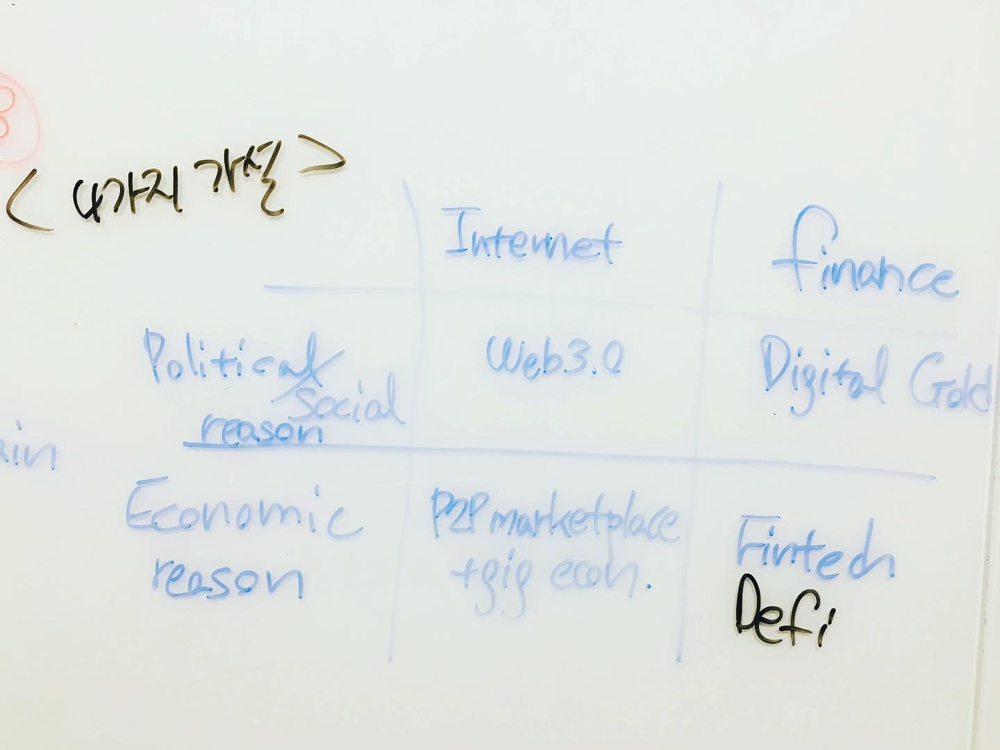

디콘은 회의를 참 많이 했다. 매번 들어오는 프로젝트 주제가 달랐다. 어느 정도 프로세스는 있었지만, 매번 새로운 기획을 내야했다. 클라이언트의 요구도 다 제각각이었다. 겹치기 프로젝트를 한 적도 있고. 그래서 빡센 회의가 하루에 늘 3개쯤 있었다.
⠀
회의가 끝나면 화이트보드에 메모가 가득했다. 마지막엔 항상 "어, 저거 누가 찍었어요?" "아 제가 찍을 게요" "슬랙에 올려주세요~" 하는 대화가 오가곤 했다. 저건 그 때 찍은 사진들이다.
⠀
글씨체를 보니 다 내가 썼네. 화이트보드 마카는 내가 많이 쥐고 있었던 것 같다. 회의 때 나대는 걸 좋아하는 타입 ㅇㅈ.. 책상 앞보단 늘 화이트보드 앞에 서있었던 기억이 난다.
⠀
정말 골치 아픈 주제가 많았다. 모든 블록체인 비즈니스를 분류해서 한판에 보여줘야 한다거나, 블록체인의 미래 발전 시나리오를 뽑고 그 영향을 정량화해야한다거나... 지금 생각하면 어떻게 했나 싶다.
⠀
하지만 나름 재밌는 면도 있었다. 난 복잡한 문제를 프레임워크로 구조화해서 설명할 때 희열을 느끼는 타입이라, '와 뭔가 이러케 이러케 설명하면 되겠는데? 오오?' 할 때는 신났던 게 기억난다.
⠀
"이 사진 잡동사니인 것 같은데 한꺼번에 다 지울래?" 구글 포토가 나에게 물었다. 참 똑똑한 친구다. 평소라면 필요없는 사진은 팍팍 지운다. 하지만 화이트보드 사진엔 추억이 많다. 조용히 '아니오'를 눌렀다. 
#1일1글

