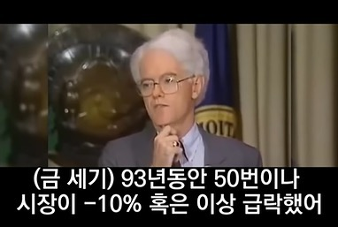

숫자가 미친듯이 내려갔다. -11.6%..-11.7%..-11.9%..-12.1%.. 주식 투자를 시작한 이래로 처음 보는 광경이었다. 온통 파란색. 뒷목이 쭈뼛 섰다. 가슴이 두근두근거렸다. 시계를 봤다. 3월 13일 금요일. 아침 9시 30분.
⠀
머리가 빠르게 돌아갔다. '와...이거 팔아야 할까?' '아냐... 사야 하는건가?' '혹시 더 떨어질까?' '지금 누가 팔고 있는 거지?' '뉴스에선 뭐라고 하고 있지?' 페이스북과 네이버 뉴스도 들어가 본다. 몇몇 페친이 금융위기라느니 하면서 포스팅을 올려놨다.
⠀
갑자기 퍼뜩 정신을 차렸다. 심호흡을 했다. 휴대폰을 닫았다. 이성을 되찾기로 했다. 주식투자 시작할 때 산이 형이 책을 추천해줬다. 피터 린치의 <월가의 영웅>. 거기서 주식투자는 장기적 관점으로 하라고 배웠다. 어차피 가격은 예측 못한다. 너가 잘 아는 기업을 사라. 끈기있게 기다려라.
⠀
여태까진 나름 잘 지켜왔다. 내가 이해하는 회사만 투자했다. 솔직히 기업 분석을 게을리하긴 했지만. 팔 가격을 마음 속에 정해뒀다. 가격에 매몰되면 안 된다고 생각하면서, 시세는 일주일에 1-2번씩만 봤다. 웃기지만 내심 그런 나를 자랑스러워했다.
⠀
이번에 깨달았다. 내가 얼마나 자만했는지ㅋㅋ 머리로 아는 것과 실제 행동의 차이를 느꼈다. 나의 짧은 투자 역사에선 계속 장이 좋았다. 진짜 폭락을 맞아보지 않았으면, 쉽게 말하면 안되는 거였다.
⠀
이성적으로 생각해보자. 만약 내가 정말 알고 투자했다면, 가격을 보며 일희일비할 필요가 없었다. 좋은 회사라면 언젠간 가격이 돌아온다. 오히려 그 시간에 코로나가 투자사 영업에 미치는 영향을 조사해야겠지. 하지만 내가 한 행동은 반대였다.
⠀
그래서 난 매수/매도 대신 이 경험을 잘 기록해두기로 했다. 폭락장에 사람의 진가가 드러난다는 말도 있지 않은가. 내가 보인 즉각적인 반응은 뭐였는지, 잘 적어뒀다. 아마 몇 달 지나면 또 까먹을 거다. 자만심이 들 때 다시 들춰봐야지. 
#1일1글

