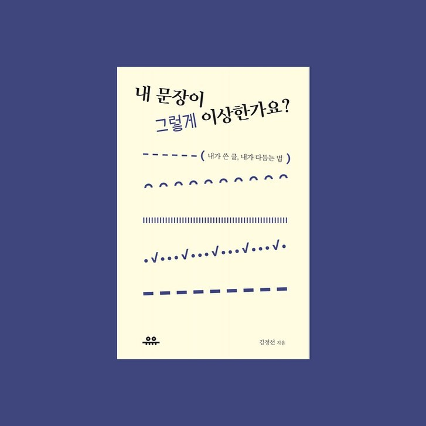

나도 술술 읽히는 문장을 쓰고 싶다. 하지만 문장론, 맞춤법을 알려주는 책은 항상 재미가 없다. <내 문장이 그렇게 이상한가요?>라는 책은 그 한계를 극복하려고 노력했다. 자기가 문장을 잘 쓴다고 생각했지만 아니었던 교수 이야기와, 저자 문장 노하우를 교차 편집했다.
⠀
노력은 보였지만, 여전히 재미가 없긴 했다. 하지만 수확은 있었다. 문장을 손볼 때 유용한 마법 단어를 얻었다! 이름하여 '적.의.를 보이는 것.들.'이다.
⠀
(적) 주도적, 잠재적. 의식적.. 삭제.
(의) 마법의 단어 -> 마법 단어
(것) 하는 것. 있는 것.. 삭제.
(들) 기업들이 노력한다 -> 기업이 노력한다.
⠀
적.의.것.들.은 치석 같다. 문장 속에 자연스럽게 박혀있다. 생각 없이 보면 군더더기처럼 느껴지지 않는다. 그러나 Ctrl+F로 정밀타격하면 보인다. 얼마나 많은지 깜짝 놀랄 정도. 용을 쓰고 지운다. 스케일링한 치아처럼 문장이 깔끔해진다. 글 고칠 때 아주 잘 써먹었다.
#1일1글

