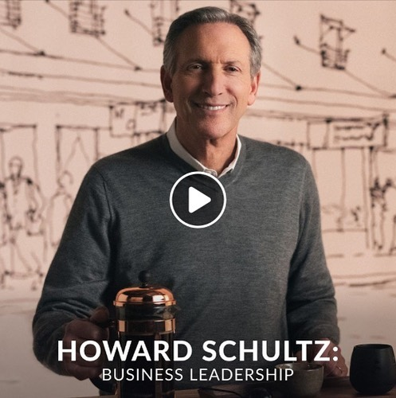

스테판 커리가 농구를, 고든 램지가 요리를, 마틴 스콜세지가 영화를 가르치는 인강 사이트 Masterclass. 스타벅스 창업자 하워드 슐츠가 비즈니스를 가르치는 수업을 들어본 적 있다. (끝까지 안들었지만) 1강이 오래 기억에 남는다. 창업을 경험하면서 느낀 것과 비슷해서 공감이 많이 되었다.
⠀
"창업이란 구명조끼 없이, 수영도 할줄 모르는 상태로 엄청나게 깊은 물 속으로 뛰어드는 것과 같습니다. 물 속에서 수영을 배워야 하죠."
⠀
"모든 기업가는 자기 의심(Self-doubt)를 가지고 있습니다. 자기 의심에는 2가지가 있는데요. 첫째는 이 일을 해야한다는 나의 확신, 헌신에 대한 의심. 둘째는 내가 성공하기 위한 능력이 있는지에 대한 의심. 두번째 의심은 나를 더 보완해줄 수 있는 사람들을 주변에 두어 극복할 수 있다고 생각합니다."
⠀
"하지만 첫번째 의심은 스스로 해결해야 합니다. 그 어떤 교과서나 멘토도 당신을 깊은 물 속으로 뛰어들게 만들 순 없습니다. 리스크를 감수하고 한계에 도전해보고 싶은 용기(courage)가 있어야 하죠. 하지만 모든 사람들이 그렇지는 않습니다. 그걸 잘 생각해보세요."
#1일1글

