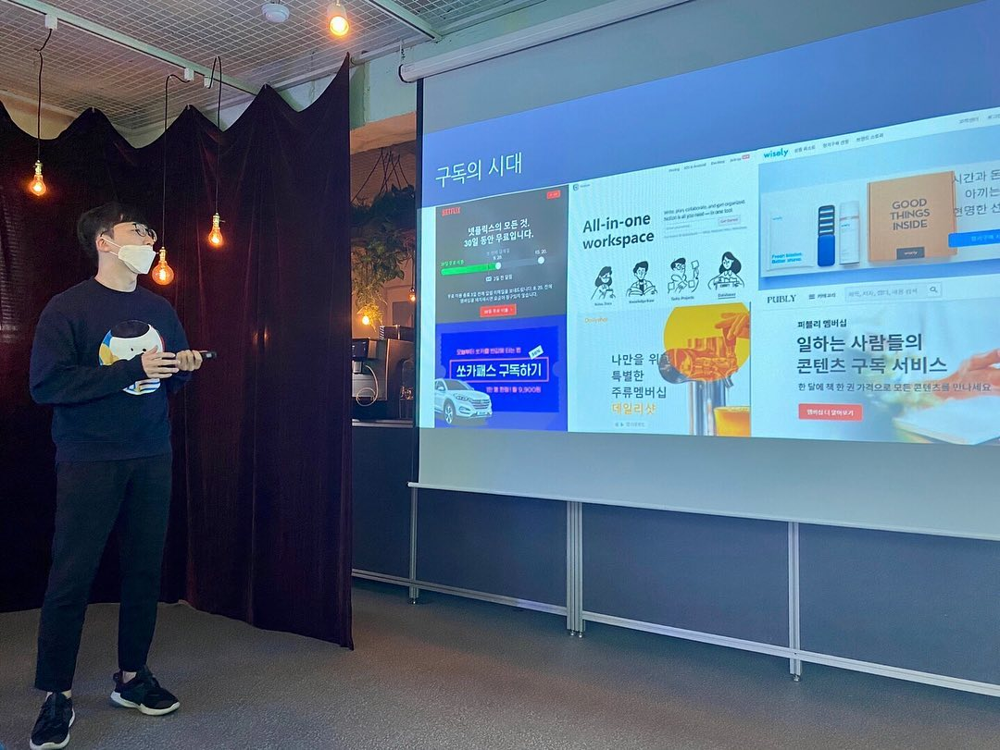

콘텐츠를 만들어야 하니 가능하면 다양한 관점, 다양한 지식을 접하려고 노력한다. 그래서 스터디/독서모임을 많이 하는 편이다.
⠀
인사이터(Insighter)도 그 중 하나. 어제가 마지막 모임이었다. 발표도 했다. 인사이터는 비즈니스 스터디다. 같이 하는 분들은 다들 직장인/사업가다. 각자 자신이 몸담고 있는 산업/직무 관련 콘텐츠를 발표했다. 5주 동안 동남아, B2B 커머스, 패션 도소매 시장, 팀워크, 금융컨텐츠, 영업, 보험업 등 다양한 주제를 넘나들었다.
⠀
결론만 말하면 무척 만족스러웠다. 고퀄리티 발표를 해주신 분이 많았다. 내가 관심있는 주제가 대부분이었고. 기사쓸 때 내용을 반영하기도 했다. 또 내 소개로 콴다에 이직한 분이 있었단 것도 뿌듯한 부분.
⠀
다만 스터디를 모든 사람에게 추천할 수는 없을 것 같다. 나도 가끔 하는 것으로 만족하려 한다. 스터디 모임은 시간과 노력과 돈을 많이 들일 수밖에 없다. 그런데 그걸 다 투입한 후에야 이 모임이 그만한 가치가 있는지 알 수 있다.
⠀
여기서 만난 인연, 여기서 만난 컨텐츠가 전혀 돈과 시간이 아깝지 않은 가치를 줄 수도 있지만, 그 반대일 수도 있다. 아주 먼 미래에 도움될 수도 있고. 어쨌든 불확실하다.
⠀
그 점만 뺀다면 어쨌든 항상 즐거운 경험이다. 진지한 주제를 놓고 수다 떨면서  그 자체로 에너지를 받기도 한다. 하지만 당분간은 사회적 거리두기..ㅜ 
#1일1글 ⠀

