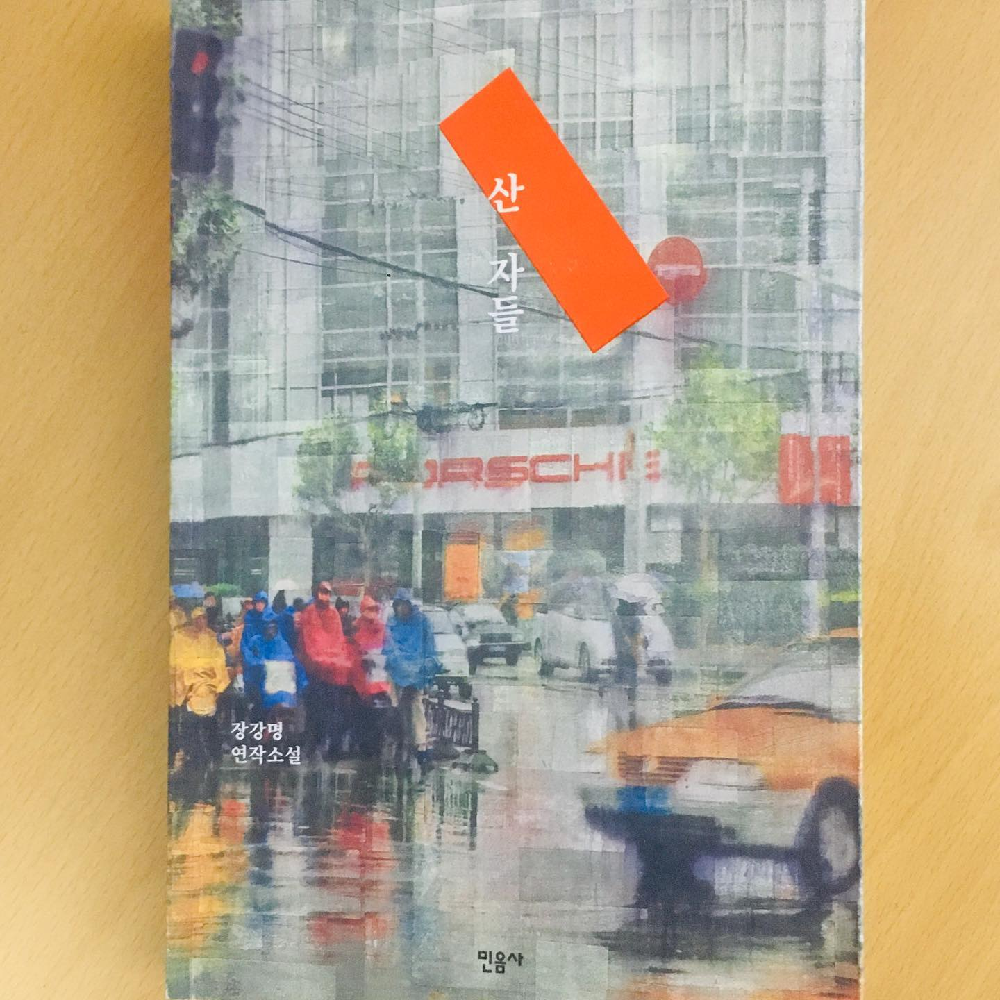

알바생을 자르고, 같은 동네 빵집끼리 전쟁하고, 진상 고객을 참아내고... 부조리하고 비인간적인 이야기. 동시에 익숙하고 자연스러운 이야기.
⠀
장강명의 <산 자들>을 읽었다. 이 시대의 '먹고 사는 일'을 다큐멘터리처럼 찍어낸 소설. 10개 단편이 담겨있는데 거의 다 재밌다. '알바생 자르기'라는 단편에선 직장에서 일어나는 미묘한 갈등의 결을 엄청나게 현실적으로 표현해서 감탁했다. 실제 있는 회사를 살짝 비트는 방식 때문에 더 진짜같다.
⠀
장류진의 <일의 기쁨과 슬픔>과 비슷하다. 다큐를 보는 것 같은 하이퍼리얼리즘과 담백한 문체. 잔잔한 공감.
⠀
다른 점도 있다. <일의 기쁨과 슬픔>은 인물의 내면, 사소한 망설임, 갈등의 감정을 1인칭으로 디테일하게 그려내서 공감을 만든다. 반면 장강명은 내면 묘사보단 행동 묘사가 많다. 전개 속도도 빠르다. 장강명의 리얼리즘은 사람과 사람 사이 관계/갈등을 입체적으로 보여주는 데서 드러난다.
⠀
<산 자들>에선 인물, 관계를 3D로 보여준다. 어느 한쪽의 관점을 단순화시켜 녹여내지 않는다. 고객의 짜증 때문에 힘들어죽는 자영업자 얘기와, 고객 입장에서 쿠폰 결제가 안되면 얼마나 짜증나는지를 동시에 다룬다. 어느 한쪽 편을 들지 않는다. 작중 화자도 자주 바뀐다. 시선에 따라 달라지는 현실 세계를 입체적으로 그리려고 노력한 게 느껴진다.
⠀
난 크게 관심없는 사회/경제 이슈는 뉴스 헤드라인만 보고 자동으로 판단해버리곤 한다. 어디가 정리해고를 했다더라, 어디가 갑질을 했더라. 그런데 <산 자들>처럼 안에 얽혀있는 촘촘한 관계를 보여주는 소설을 읽고 나니, 그런 문제의 선악 구도를 함부로 판단하면 안되겠다는 생각이 들었다.
#1일1글

