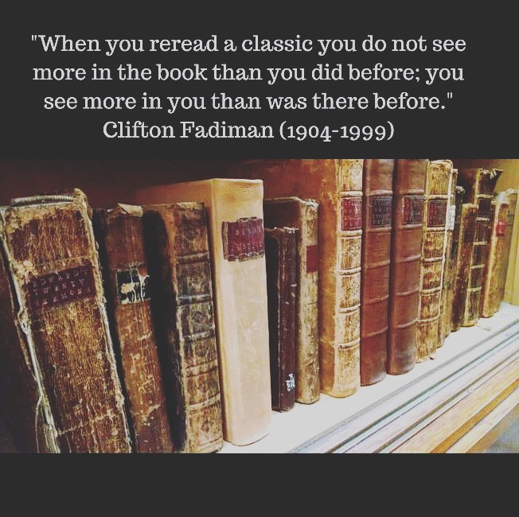

어떤 책이 좋은 책일까?
⠀
'정말 좋은 책이다' 하고 느낄 때가 있다. 이유는 다양하다. '내가 전혀 몰랐던 사실을 알려주네' 일수도 있다. 하지만 경험상 그런 이유는 '괜찮네' 수준에 그친다. '정말 좋았다' '인생 책이다'라고 느낀 책은 좀 다르다.
⠀
'인생 책'은 내가 전혀 몰랐던 사실을 말하지 않는다. 이미 내가 마음속에 가지고 있던 생각이 담겨 있다. 어렴풋하고, 모호하며, 표현할 생각조차 하지 못했던 생각이. 작가는 그걸 참신한 방법으로 표현한다.
⠀
좋은 책을 읽으면 이미 내 안에 있던 어떤 생각/믿음/감정이 '찌릿'하고 반응한다. '와 거기에 그런 게 있었구나.' '맞아. 나도 그런 경험이 있었어.' '나도 그렇게 생각해.' '이거 좋은 책이다.'
⠀
다시 말해,나는 '이미 가진 생각/믿음과 공명하는 책'을 좋다고 느낀다. 내가 아예 전혀 동의하지 않거나, 아예 관심 없는 내용은 애초에 잘 집어 들지도 않고, 공감하지도 못하니까.
⠀
나쁘게 보면 필터 버블의 일종이다. 책의 목적이 '현실을 아는 것' '사실을 기억하는 것'이라면 그렇다.
⠀
하지만 책의 목적을 다르게 볼 수도 있다. 나도 몰랐던 나를 보게 만드는 것이라고. 책이 나의 일부를 '쿡' 하고 찌른다. 나를 이루는 의식의 뿌리를 발견하고, 질문하고, 표현할 수 있는 능력이 생긴다.
⠀
이렇게 보면 좋은 작가의 의미도 달라진다. 좋은 작가는 독자에게 모르는 내용을 가르쳐주는 사람이 아니다. 좋은 작가는 독자가 이미 알고 있는, 믿고 있는 것을 들여다볼 수 있게 해준다.
#1일1글

