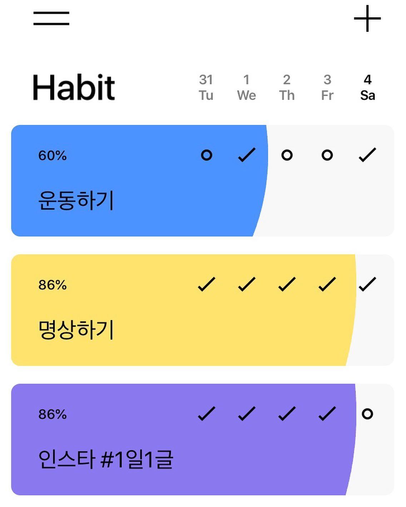
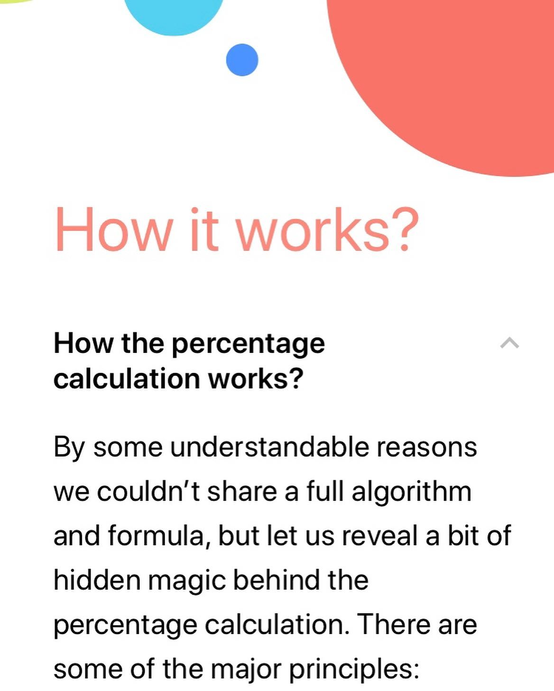

최근 다운받은 앱 중에서 가장 유용한 앱, 해빗(habit)
⠀
2달쯤 전. 애플 앱스토어 피쳐드. '꾸준히 실천해보세요'라는 카피가 달려있었다. 눌러봤다. 습관 만들기 도와주는 앱을 소개하고 있었다. 그 중 해빗(habit)이 눈에 띄었다.
⠀
일단 디자인이 예쁘고 깔끔했다. 이름도 그렇고, 기능도 그렇고 아주아주 단순한 앱이다. 습관을 하나 만든다. 박스가 하나 생긴다. 그날 했는지 체크한다. 최근 5일간 달성 여부를 보여준다.
⠀
'습관 형성 정도(%)'를 계산해서 보여준다. 이게 제일 마음에 드는 기능이다. 매일 체크할 때마다, 퍼센트가 조금씩 올라간다. 박스 색깔도 점점 차오른다.
⠀
누를 때마다 퍼센트가 올라가고 박스가 차오르니까, 이게 은근 동기부여가 된다. 올린다고 뭐 주는 것도 아니고, 가짜로 눌러도 되는 거지만. 이게 은근히 희열이 느껴진다. 목표, 그리고 달성한 정도를 시각화해서 보여주니 생각보다 강력한 효과가 있다.
⠀
앱은 일부러 퍼센트 계산식은 공개하지 않는다. 다만 얼마나 꾸준히 했는지에 따라 늘어나고, 반복량이 쌓이면 쌓일수록 천천히 올라간다. 처음 한번은 5%씩 올라가지만, 30번째에는 1%만 올라가는 식이다.
⠀
100%를 달성하려면 대략 91번을 꾸준히 해야한다고 한다. 이 정도를 습관이 형성되어 잘 유지되는 경지라고 보는 것 같다.
⠀
무엇보다 무료다. (프로 버전도 있긴 함) 습관 만들고 싶은 사람에게 꼭 추천해주고 싶은 앱!
⠀
#1일1글

