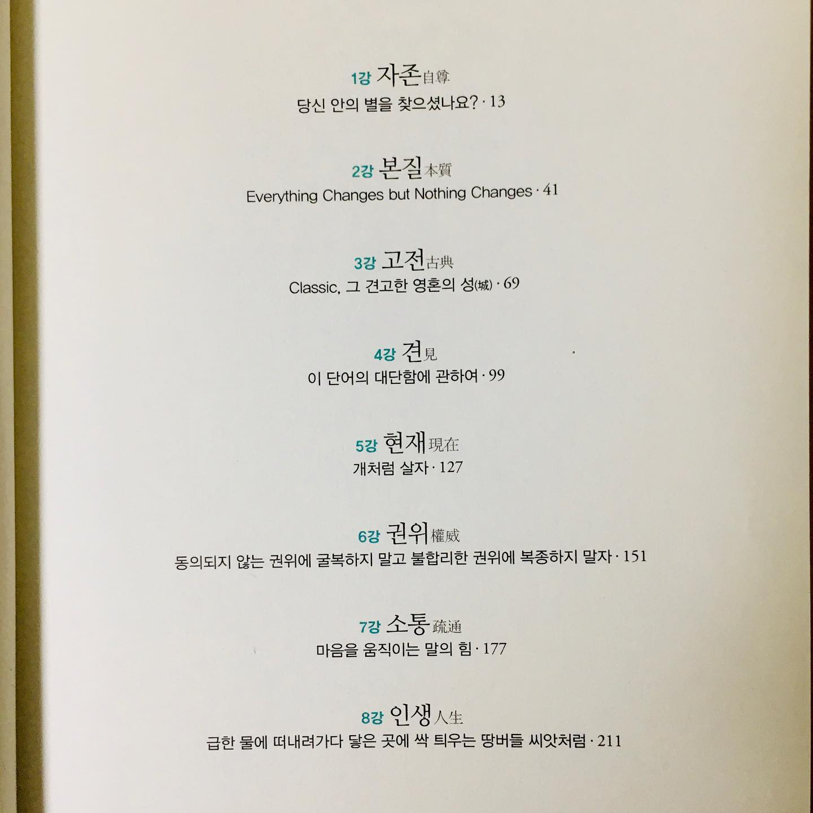

인생 책 리뷰 2편. <여덟 단어>
⠀
군대 시절 책을 꽤 읽었다. 시간이 많았으니까. 원래 내가 읽는 책의 80-90%는 사회과학책이었다. 하지만 군대에선 편식하면서 배부를 수가 없었다. 조그마한 군대 도서관에는 책이 그렇게 많지 않았다. 그래서 철학/인문학 책을 많이 읽었다.
⠀
군바리는 전역일이 가까워지면 가까워질수록 철학자가 된다. 내 미래는 어디로 흘러가는가... 나는 어떻게 살아가야 하는가... 이런 고민을 자연스럽게 하는 때.
⠀
인문학 책에 공감이 잘 될 수밖에. 뭘 읽었더라...? 철학 통조림 시리즈, 그리스인 조르바, 스무살을 위한 철학, 꾸뻬씨의 행복 여행.. 이런 제목이 떠오른다. 이 책들을 읽고 나면 하루이틀 정도는 진지진지 열매를 먹은 느낌이었다. '너 왜 사냐?' '뭐할 때 행복하냐?' '앞으로 뭐하고 살거냐?' 고민을 많이 했다. 지금 생각해보면 그 고민이 꽤 값졌다.
⠀
그 중 가장 기억에 남는 책이 <여덟 단어>다. 박웅현은 광고회사 디렉터다. <책은 도끼다>라는 베스트셀러도 썼다. <여덟 단어>는 강의 내용을 적은 책이다. 자존, 본질, 고전, 견, 현재, 권위, 소통, 인생 이라는 8가지 주제를 다룬다. 난 자존, 견, 현재 이 세 챕터가 가장 인상깊었다.
⠀
<사피엔스>가 세계를 바라보는 관점이라면, <여덟 단어>는 내가 삶을 바라보는 관점에 기여한 책이라고 할까. 구어체라 편하게 술술 읽히는 것도 장점.
⠀#1일1글

