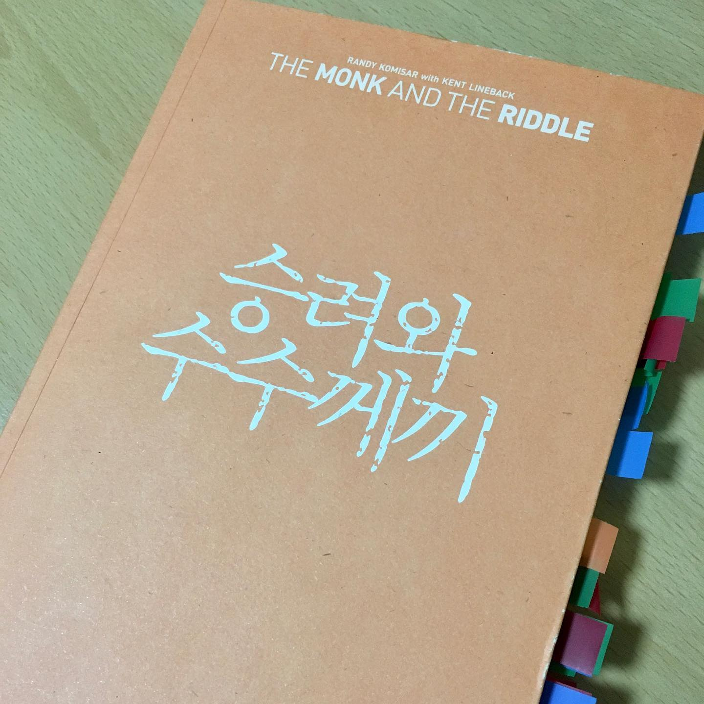

인생 책 리뷰 4번째. <승려와 수수께끼>
⠀
저자 랜디 코미사는 1980년대 애플부터, 여러 벤처기업 창업자/경영자를 지낸 사람이다. 전설적인 벤처투자자이기도 하다. 승려와 수수께끼는 그의 사업, 인생 철학을 담은 책이다.
⠀
이 책의 재미는 '스토리'다. 레니라는 젊은 창업가가 투자해달라고 찾아온다. 레니는 혈기만 왕성하다. 랜디는 자기 경험담과 조언을 풀어준다. 동시에 레니와, 레니 공동창업자, 다른 투자자 시선도 같이 엮는다.
⠀
소설 같기도 하고 자서전 같기도 하다. 그래서 그냥 읽어도 재밌다. 뻔한 자서전 식이었으면 이만한 감동은 없었을 거다.
⠀
<승려와 수수께끼>가 '좋은 책'을 넘어 '인생 책'인 이유. 내가 사업을 그만둘까 고민할 때 읽었기 때문이다. 한줄 한줄 공감되는 말이 너무 많았다. 레니가 나인 것 같았다.
⠀
‘미뤄 놓은 인생 설계'라는 장이 가장 기억에 남는다. 나는 '책임감'과 '원하는 일'을 두고 고민하고 있었다. '미뤄놓은 인생을 살지 말라'는 말이, 망설이던 나를 뻥차서 나아가게 만들었다.
⠀
마지막 문장을 읽었을 때 묘한 기분이 아직도 생각난다.
'더 이상 인생을 낭비할 시간이 없다'
#1일1글

