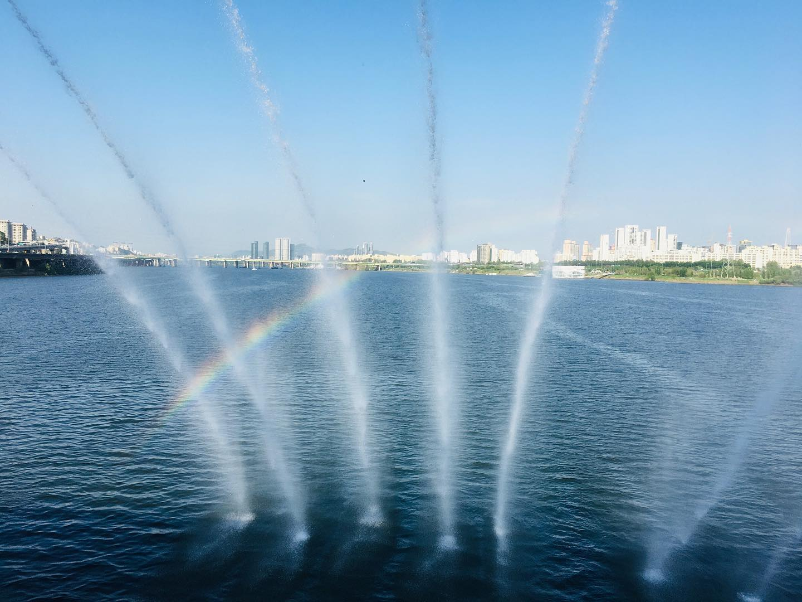
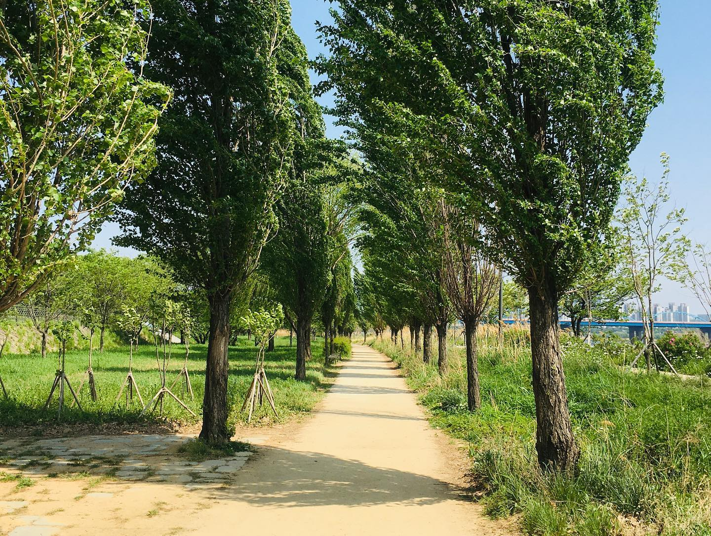

어제 아침에 일어나서 생각했다. '오늘은 월요일. 이미 4일이나 쉬었다. 근데 오늘도 쉰다. 내일도 또 쉰다. 아싸.'
⠀
지압을 받으러 갔다. 연지 이름으로 예약했더니 인액터스에서 왔다며 선생님들께 VIP 취급을 받았다. 어깨를 삭- 풀어주시는데 너무 시원했다. 지갑 사정상 자주 오긴 어렵지만, 정말 가심비 오진다.
⠀
초밥 먹고 싶다고 말하면서 나와보니, 바로 앞이 초밥집이었다. 맛집이다 은근. 이수-방배 사이 있는 힙한 카페에 들어갔다. 식후 아메리카노를 샀다. 커피를 받아 한 입 마셨다. 딱 내 취향이었다. 또 플러스 1점.
⠀
이수역을 지나다 중고서점을 발견했다. 책 구경하러 들어갔다. 청소년 교양서 서가에서 계림사 세계문학전집, 삼성출판사 전집 등을 봤다. 옛날 꼬맹이 시절 추억이 새록새록 떠올랐다. '천둥이 꽈광꽈광' '건축이 흔들흔들' 같은 교양 과학서도 있었다. 옛날에 진짜 재밌게 읽었는데. 중고 서점은 역시 이런 거 발견하는 매력이 있다.
⠀
이촌한강공원에 갔다. 봄바람이 살랑살랑 불어왔다. 날씨가 덥지도 않고 춥지도 않고 완벽했다. 벤치에 앉아, 스피커로 노래 틀어놓고 들었다. 하늘이 파랬다. 진짜 날씨 좋다-는 말이 계속 튀어나왔다.
⠀
걸어서 잠수교를 건넜다. 갑자기 분수가 터졌다. 무지개가 떴다. 조명이 아니라 무지개로 꾸민 분수쇼였다. 열심히 사진을 찍었다. 저렇게 선명한 무지개를 본적이 언제였지. 넋놓고 봤다. 맞춰서 온 것도 아닌데 걷는 동안 딱 틀어줘서 감사했다.
⠀
저녁은 요리를 해먹었다. 수육 + 비빔면. 수육이 기름지고 비빔면이 상큼해서 찰떡궁합이다. 모든 게 착착 완벽했던, 즐겁고 감사한 휴가날이었다.
#1일1글 #101일차

