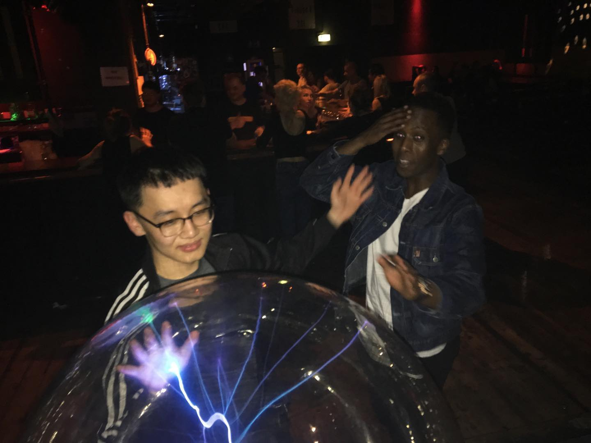

Sabim and Faysal complained to me today. "You should translate your Instagram caption. I want to read it. Google translation sucks."
⠀
I was an exchange student in Netherlands 3 years ago. That’s where I’ve met Sabim & Faysal. Though I don't remember how we start hanging out, we become close quickly. They are my best friends sharing one of the most fun times in my life. (kinda embarrassing to say 'best friend'. But it's true anyway.)
⠀
So, I decided to write in English. Just for today. My English skill got so bad. I don’t think I can translate every piece. But, doing it sometimes.. why not?
⠀
Sabim is a guy in charge of banter. (Me? reaction.) He is Nepalese British. Looks like Korean at first glance though what he knows are just 2 words. Oppa and senpai. (Senpai is not even Korean.) He studies psychology. His motto: “Eddy, everything is mental.”
⠀
Faysal is Somali German. He is a kinda teacher to me. He likes to explain all cultural things such as Arabic, African culture, hip-hop. Funny thing is he's always confident in the room. but too shy to do it in a real situation. His motto: “Nah, not right now. next time, Eddy.” That’s always our source of fun.
⠀
Unlike others who proves ‘out of sight, out of mind.’, we still talk often. They both came to Korea to see me. I should go to Europe someday after corona, hopefully. Can't wait to enjoy the reunion.
⠀ 
#dailywriting #1일1글

