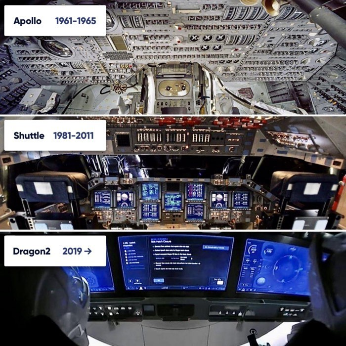

(긴글 주의) 스페이스X가 유인우주선 발사에 성공했다. 민간 기업 최초. 역사적인 성과다. 희열에 찬 엘론 머스크 사진이 인터넷을 점령했다. 그런데 내 눈에 더 흥미로웠던 건, 스페이스X 우주선 내부 사진이었다.
⠀
사진을 보고 아이폰이 떠올랐다. 애플은 매킨토시 시절부터 소프트웨어 인터페이스의 선구자였다. 잡스는 아이폰에서 물리 키보드를 없앴다. 풀 터치 스크린. 인터페이스를 소프트웨어화했다.
⠀
서드파티 앱 개발자들이 더 자유롭게 인터페이스를 만들어낼 수 있다. 그 결과로 모바일에서 엄청나게 많은 것들이 가능해졌다.
⠀
테슬라도 마찬가지. 우리가 아는 자동차는 온갖 버튼, 스위치로 조작한다. 하드웨어 인터페이스다. 하지만 테슬라는 이걸 다 터치스크린으로 바꿨다.
⠀
테슬라는 차를 새로 설계하지 않고도 인터페이스를 유연하게 바꿀 수 있다. 업데이트만 하면 새로운 기능과 인터페이스를 추가할 수 있다. 이전 자동차 업계에선 상상하기 힘든 일이다.
⠀
스페이스X의 드래건은, 아이폰과 테슬라를 닮았다. 우주선이나 비행기 조종하면 떠오르는 이미지가 있을 거다. 영화에서 보면 막 탁탁탁 스위치 올리고 위이잉 레버 당기고 밸브 요리조리 돌린 다음, 무전기 들고 '클리어!' 이러잖아. (여기서 약간 정신없어줘야 프로같음)
⠀
드래건엔 그런 게 없다. 거대한 터치스크린만 달려있다. 우주비행사는 터치스크린을 가지고 복잡한 우주선을 제어한다. 이걸 보면서, 와 우주선까지도 이제 점점 더 소프트웨어화되는구나란 생각이 들었다.
⠀
좀 비약일 수도 있지만, 이건 단순 인터페이스를 떠나서, IT가 만드는 패러다임 변화의 핵심 축이다. 뭐든지 '가상화'시키는 것. 물리적으로 건드리지 않고 소프트웨어로 구현하는 파트를 늘린다. 대가로 얻는 건? 극도의 유연함.
⠀
우리가 잘 보진 못하지만, 우리가 쓰는 컴퓨터/스마트폰이 아니라, 소프트웨어가 돌아가는 백엔드 서버에서도 똑같은 변화가 일어나고 있다. 다 물리 서버 의존도를 줄이고 더 자주, 더 유연한 업데이트가 가능해진다. 그게 클라우드고 SaaS다.
⠀
테슬라도 인터페이스만 다른 게 아니다. 현차 다니는 형이 말해준 건데, 테슬라는 기존 차와 내부가 완전히 다르다고 한다. 소프트웨어가 제어하는 부분이 훨씬 많다.
⠀
세상 많은 기계들이 점점 소프트웨어화-가상화-디지털화된다. 심지어 우주선까지! 소프트웨어의 영역이 넓어진다. 적은 비용으로 수정, 재배포할 수 있게 된다. 한계 비용이 낮아진다. 변화와 개선이 빨라진다.
⠀
소프트웨어가 무조건 더 좋은 건 아니다. 하지만 더 좋은 게 무엇인지, 더 많이 시도해보고, 쉽게 바꿀 수 있단 건 확실하다.
⠀
우주선 사진을 보고 새삼 느꼈다. 'Software is eating the world'가 맞긴 맞구나.

#1일1글

