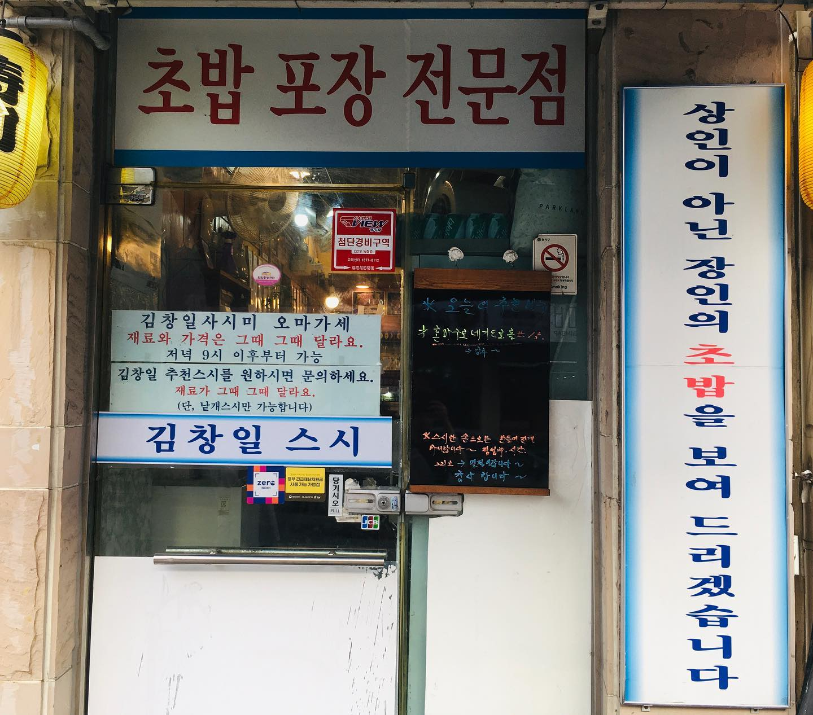
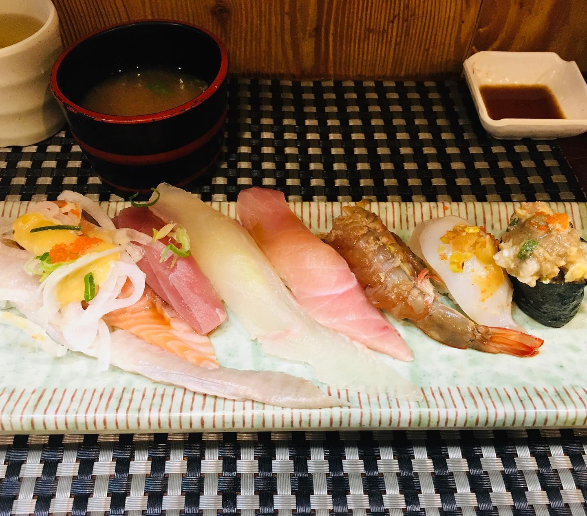

낙성대 초밥 맛집. 관악산 산책 갔다 내려오는 길. 오랜만에 들렀다. 
10명도 못 들어갈 정도로 좁다. 내부 인테리어나 음악(안 어울리고 시끄러움)도 그닥인데. 
그런 거 다 제낄 정도로 맛만큼은 진짜 끝내준다. 치즈새우나 장어계란처럼 화려한 스타일 초밥이 많다. 
상호랑 메뉴에 다 자기 이름을 쓰신다. 밖에 걸린 슬로건까지.. 강려크한 장인 정신이 느껴지는 곳. 
#1일1글

