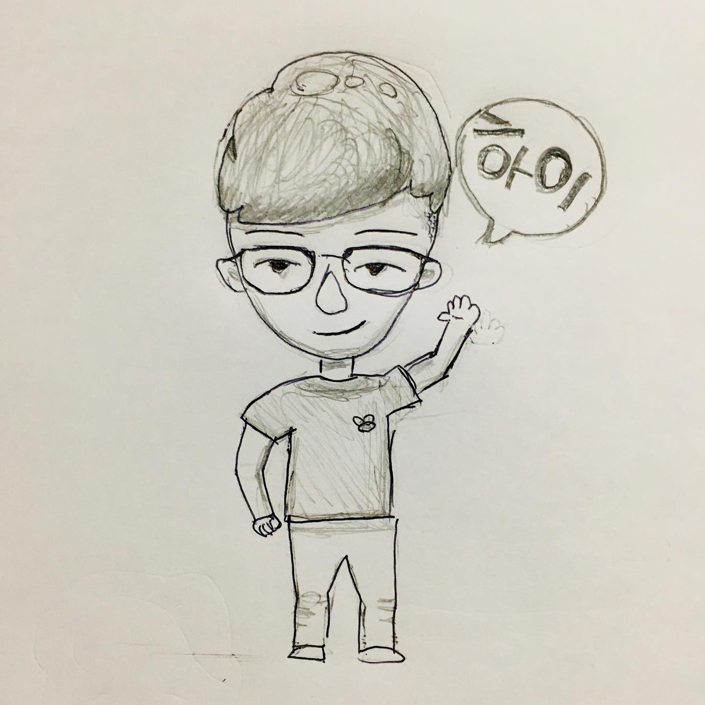
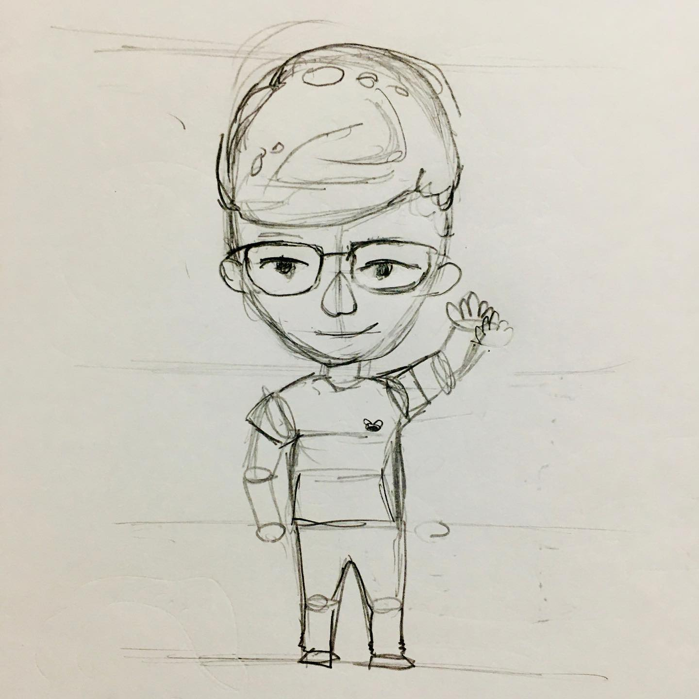

어젠 그림을 그렸다.
⠀
마지막으로 그림 그려본 게 언제였나? 생각도 잘 나지 않는다. 연필 잡는 느낌이 어색하다. 지우개가 없어서 막 찾았다. 지우개 안 쓴지 최소 3년 된 거 같다.
⠀
딴짓을 뭐해볼까 하다가 그림을 그려봤다. 평소에 그림을 잘 그리고 싶다는 작은 욕망이 있었기 때문이다.
⠀
글을 쓰다보니 그림도 욕심이 생긴다. 모바일 독자들은 텍스트에 집중을 못 한다. 내가 아무리 한땀한땀 글자로 십자수를 놓아도, 사람들은 초스피드로 엄지만 슥슥 닦고 넘어간다. 지금 여러분이 인스타 내리는 속도를 생각해보시라.
⠀
아웃스탠딩은 이미지와 임티를 많이 활용한다. 처음에는 언론치고 너무 캐주얼하지 않나 싶었지만, 막상 쓰고 읽고 반응 보니까 왜 하는지 확실히 알겠다. 가독성이 천지차이다. 통닭가슴살과, 소스 바른 닭가슴살 큐브 차이쯤 된다. 텍스트만 있으면 읽기 힘들다. 잘 엮인 이미지는 숨통을 틔우고 맛을 내준다.
⠀
하지만 임티랑 구매한 이미지는 한계가 있다. 내가 그리는 게 아니니까, 내 글스토리에 딱 맞게 녹여내지 못한다.
⠀
그래서 일러스트나 만화 캐릭터를 그릴 줄 알면 좋겠다고 생각했다. Wait but why라고 내가 즐겨보는 블로그가 있는데 그림을 되게 잘 쓴다. WBW는 그림을 잘 그리는 것도 아니다. 그냥 졸라맨이다. 하지만 내용이 위트있고 이해도 쉽게 만들어준다.
⠀
맘먹고 찾아보니 인터넷에 무료 강의가 많다. 30분 듣고 따라 그려봤다. 얼굴이랑 몸통 비율 배분하는 법, 그림자 넣는 법을 알려줬다. 강사가 그림그리기를 두려워하지 말고, 매일매일 하면 누구나 늘 수 있다고 한다. 글쓰기랑 똑같네. 앞으로 매일 조금씩 그려봐야겠다.
⠀
#1일1글

