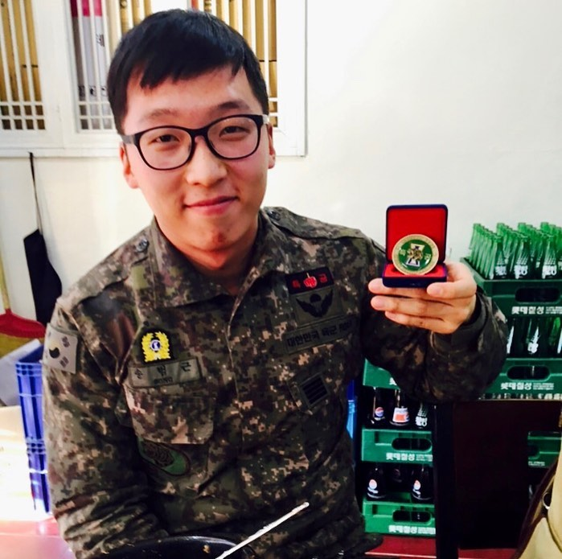

@yjpdone 가 근황을 물어본 김에, 그 동안 내가 한 일을 의식의 흐름대로 써봤다. 준필이 마지막으로 본 게 2016년 초니까 그때부터. 나도 한번 돌이켜보는 재미도 있고. 4년 반이나 되는 스토리라 짧게 쓰려 했지만 길 거 같다. 잘라서 하나씩 올려야겠다.
⠀
내 전역일은 1월이었지만, 사실 50일 가까이 말년휴가를 써서 이미 반쯤 자유인 같은 상태였다. 그 때 병길이형을 만났다. 좋다던 삼성을 때려치고 창업을 한지 얼마 안 되었을 때였다. 형이 복학 전에 시간 있으면 우리 회사에서 인턴으로 일해보자고 했다.
⠀
스타트업이 뭔지도, 만들고 있다는 로보 어드바이저가 뭔지도 그땐 전혀 몰랐다. 하지만 마침 스타트업 열기가 뜨거울 때였다. 나도 당시 군대에서 엘론 머스크와 주커버그 스토리를 재밌게 있었고. 스타트업에서 일해보고 싶다는 막연한 '로망'이 있었다. 딱 2달만 일하는 거니까 안 될게 뭐 있겠어라고 생각했다.
⠀
회사 이름은 파운트였다. 파운트는 그때 정직원이 5명이었나... 정말 초기였다. 사무실에 갔는데 무슨 지하 2층 창고였다. 실리콘밸리에선 차고에서 창업한다더니.. 진짜 창고에 커튼치고 책상 갖다놓은 상태. 창문도 없고 찬바람이 숭숭 들어왔다. (위 사진이 그 창고다)
⠀
아직도 거기서 일할 때 생각하면 겁나 추웠던 기억이 난다ㅋㅋ 나름 또 현역 군인이라고 센척했다. 가장 추운 문 근처 자리 앉았다. 근데 군대에서 혹한기 훈련하면서도 안 걸려본 감기가 걸리더라...
⠀
여전히 나는 말년 휴가 상태였다. 1월 27일에 회사에서 일하다가 군복으로 주섬주섬 갈아입었다. 지하철타고 부대 복귀했다. 음 그 때 준필이가 전역모 해줬었지. 하루 자고 다음날 28일 아침에 전역했다. 동기인 규윤이랑 고양동에서 감자탕에 소주 한잔 걸쳤다. (2번째 사진. 전역일이라 다소 신남) 집에 가서 옷 갈아입고 다시 회사에 출근했다... 왜 그랬지 그때...
⠀
당시 해민이랑 같이 인턴을 했다. 회사 방향성 결정에 필요한 각종 시장 리서치 및 고객 인터뷰 등을 했다. 당시 토스, 브로콜리 같은 앱을 보면서 이거 송금 도대체 어떻게 되는 거지? 이거 정보 어떻게 긁어오는 거지? 연구했던 기억이 난다. 지금은 너무 보편적인 앱인데 당시만 해도 정말 신개념이었다.
⠀
일하기로 한 기간이 끝나갔다. 대표님이 정직원 대우를 해주겠으니 혹시 휴학하고 좀 더 일해줄 생각없냐고 했다. 해민이는 안 했지만, 나는 좀 고민이 됐다. 비록 회사는 혼란의 카오스였지만, 내가 주도권을 가지고 일할 수 있는 분위기가 좋았다. 뭣보다 IT업계가 너무 흥미로웠다. 다만 군휴학도 2년이나 해서 이젠 복학해야하지 않나 싶었고, 벌써 학교앞에 자취방도 구한 상황이었다. 어떻게 하지? (다음에 계속)
⠀
#1일1글

