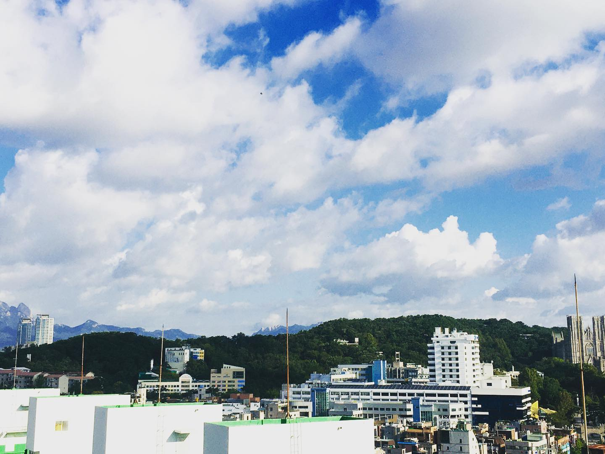

오늘은 7시쯤 일어났다. 아침엔 운동을 해야하는데. 헬스장은 못 간다. 동네 한바퀴나 뛰어볼까? 부스스한 머리에 마스크만 걸치고 밖으로 나갔다. 7시 20분.
⠀
나오자마자 하늘이 보였다. 나도 모르게 와, 소리가 나왔다. 너무 맑은 하늘. 탁, 하고 터지는 듯한 시원한 하늘이었다.
⠀
바람도 선선하게 불었다. 가을 날씨였다. 갑자기 유럽 생각이 났다. 네덜란드가 여름에 딱 이런 날씨였는데.
⠀
집 근처 산책로로 갔다. 야트막한 동네 산을 오르내리는 코스다. 카이스트 홍릉캠부터 외대 후문까지. 오르막길이 꽤 있지만 열심히 뛰었다. 산책 나오신 어른들을 앞질러가며 나무 데크 위를 달렸다. 탁탁탁탁.
⠀
정상 직전에 거의 40도 경사가 나왔다. 울퉁불퉁한 길을 헉헉거리며 올라갔다. 아씨 힘들어.
⠀
갑자기 군대 산악구보가 생각났다. '결사특공 구호붙여 갓!' '결! 사..! 트윽....! 허억헉...' 전역 후에는 한동안 절대 등산을 하지 않으리 다짐하게 만든 악마의 산악구보.
⠀
정상 이후부터는 내리막이라 쉬웠다. 짚 쿠션(?)이 깔려있어서 푹신하다. 내리막길에서 뛰니까 우오아악- 하는 느낌으로 한번에 다다다 내려갔다. 이런 속도감 좋다.
⠀
갑자기 생각이 들었다. 산악 자전거 왜 타는지 알겠네. 예전에 페북에 누가 산악자전거 고프로 영상 올린거 본 적이 있다. 고속으로 산 내리막을 질주하는 느낌이 생생했다. 돌하고 나무뿌리에 걸려 계속 자전거가 쾅쾅하고 튀어오르더라. 영상 볼땐 와, 무섭겠다 싶었는데. 확실히 재미는 있을 것 같아.
⠀
돌아오는 길엔 경희대 캠퍼스를 질러왔다. 개강해서 그런가 문 열어놨네. 평화의 전당 앞을 지나가는데 전망 탁 트여있어서 하늘이 시원하게 보였다. 다시 한번 우와 소리가 저절로 나왔다.
⠀
집에 돌아와서 씻으니 8시 20분. 개운하다. 좋은 아침 조깅이었다.
⠀
 #1일1글

