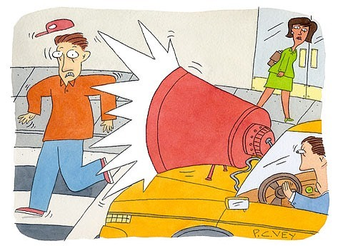

빵빵!! 빠아아앙!🔈
⠀
경적 소리는 듣기만 해도 불쾌해진다. 아니.. 목숨이 왔다갔다하는 상황이라서 시끄럽게 빵빵 거리면 당연히 이해한다 이 말이야.
⠀
하지만 대부분은 그냥 성질 급한 사람들이 '빨리 안가?!' 라는 뜻으로 눌러댄다. 당사자들 뿐만 아니라 주변 사람들한테도 소음 공해가 간다. 어떤 사람은 한 5초쯤 빠아아아아아앙 누르는데 정말 극혐.
⠀
저 소리 좀 어떻게 못 바꾸나?
⠀
물론 경적을 아예 없앨 순 없겠지. 하지만 꼭 저렇게 기분 나쁜 빵! 소리가 아니어도 되잖아.
⠀
디로링 디로링-이라거나, 딸랑딸랑- 이라거나, 뭐 아이폰에 있는 수많은 알람 소리 중에 하나를 써도 되는 거 아닐까?
⠀
아니면 녹음을 해도 되겠다. 약간 지하철 성우 목소리 같은 걸 녹음하면 어떨까. 어차피 경적 쓰는 상황이 뭐 엄청 많겠어? 멈추세요! 빨리 가주세요! 신호 바뀌었어요! 상황별로 녹음해다가 틀어주면 되지.
⠀
까똑 알림 소리처럼 귀여운 목소리나, 아니면 중저음 남자 목소리로 커스터마이즈도 가능하게 하고... 잘 들리게 소리만 조정하면 주의 환기 효과도 충분하다. 별 일도 아닌데 빵! 하는 것보단, 언어로 듣는 게 훨씬 기분도 덜 나쁘고 주변 사람들에게 소음 공해도 없을 거 같다..
⠀
흠, 아무리 생각해도 구현 못할 기술은 아닌 것 같은데. 자동차 회사에 건의하고 싶다. 오늘의 잡생각..
⠀
 #1일1글

