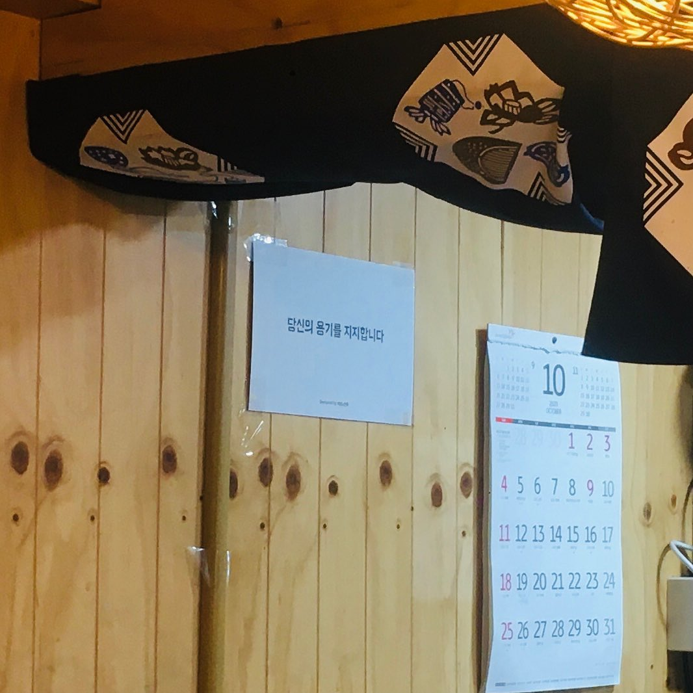

어제 한 일식집. 주방쪽에 두꺼운 종이 하나가 교실 급훈처럼 붙어있었다. 
⠀
당신의 용기를 지지합니다 by 배달의민족
⠀
나도 배달 시켜먹다 본 적 있다. 사장님이 문구를 보고 붙여둔 것 같다. 마침 사장님 직원들도 다 젊은 청년분이어서,저 문구를 보니 가게 분위기가 더 열정적으로 보였다.
⠀
배민 영업사원이 와서 이거 좀 붙여주세요 하지 않았을텐데. 마음을 움직이는 카피 하나가 저런 풍경을 만드는구나.
⠀
저 카피는 진짜 잘 쓴 것 같다.
#1일1글

