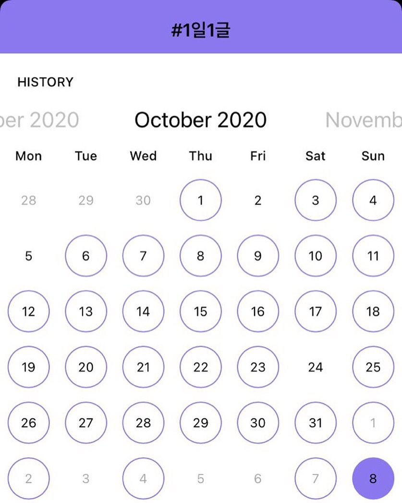

하루 하나씩 글을 쓰고 있다. 아주 쉽다. 분량도 없고, 기준도 없다. 누가 뭐라고 하지도 않는다. 정 힘들면 대충 한 줄만 써서 올리면 된다. '쓰는' 시간은 1분도 안 걸릴 수 있다.
⠀
동시에 한없이 어렵다. 단순히 쓰기가 어려워서가 아니라, 마음속에서 검열이 일어나기 때문이다. 뭔가 그럴 듯한 말을 해야지. 이건 예전에 했던 말인데 또? 이건 너무 찌질한 생각이야. 쓰면 안 돼.
⠀
매일 '그럴듯한' '마음에 드는' 글이 나올 순 없다. 하지만 내 에고는 허접하거나 의미없거나 정리 안 된 생각을 쓰는 걸 용납하지 않는다. 그래서 매일 쓰기는 힘들다.
⠀
1일1글이 잘 써지지 않으면, 아 내 마음이 거만해졌구나. 뻣뻣해졌구나 하고 느끼곤 한다. 정신 차리고. 아무것도 아닌 걸 쓰자. 그래야 내가 쓰고 싶은 좋은 글이 나온다. 
#1일1글

